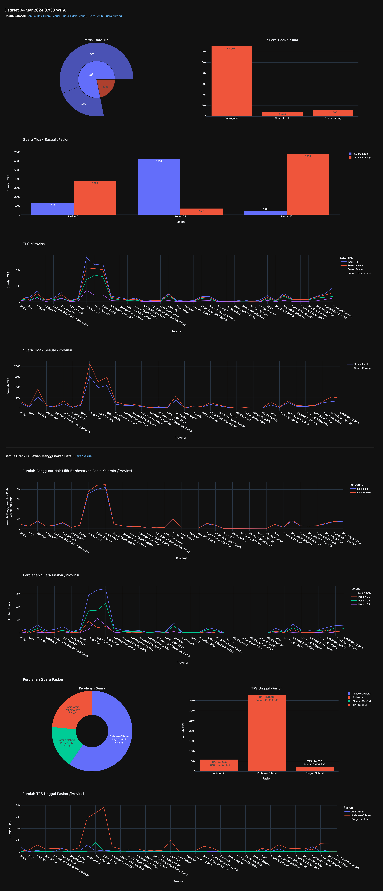

Untuk analisa bisa gunakan file analysis.ipynb, dataset terakhir bisa didapatkan di [release terakhir](https://github.com/khrlimam/pemilu2024-suara-tps/releases). Video penjelasan hasil eksplorasi ini bisa dilihat di link [youtube ini](https://youtu.be/jelGPskUlFw?si=iNfLnhnXana9AIpX)
